# Utvalgte diagram

# Statens inntekter frå petroleumsverksemda

# Norsk sokkel

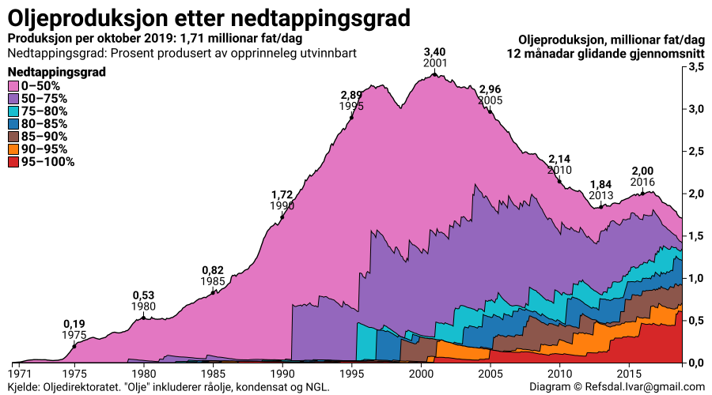

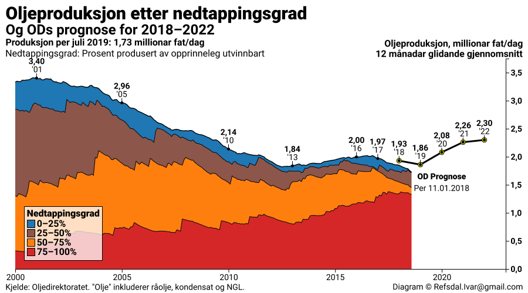

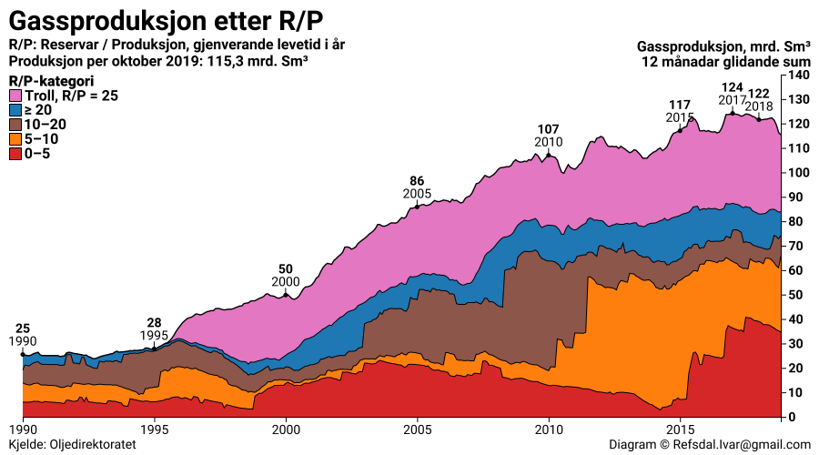

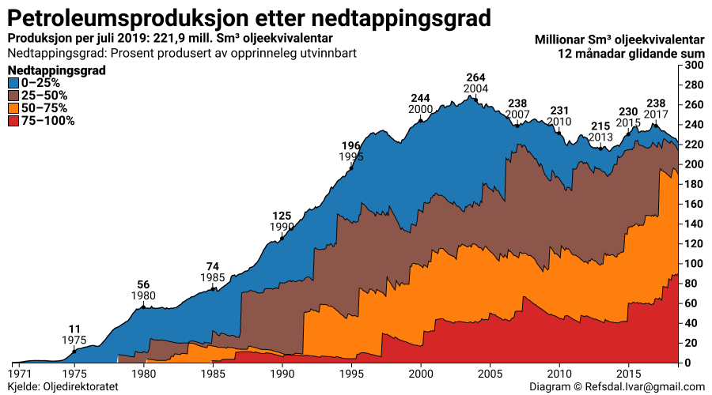

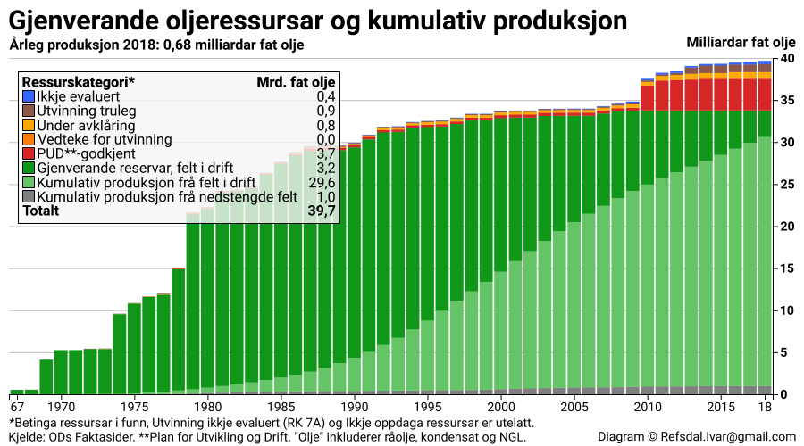

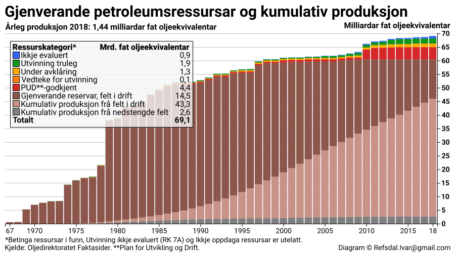

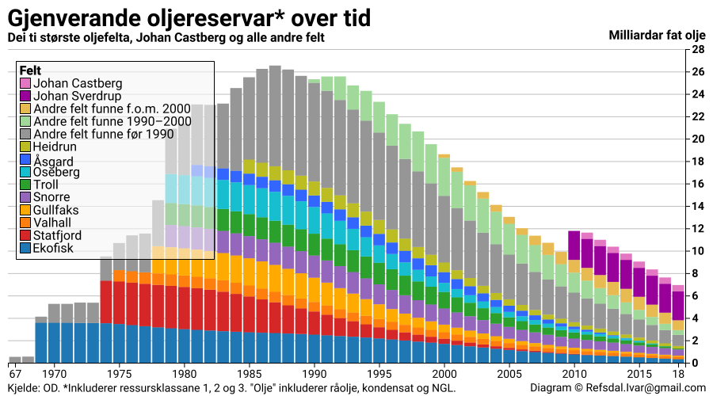

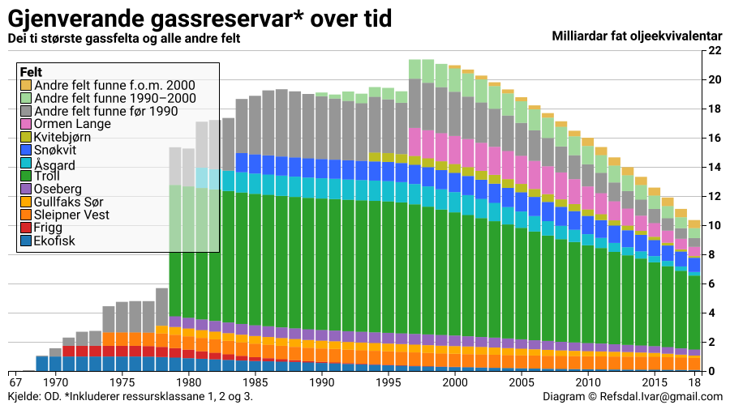

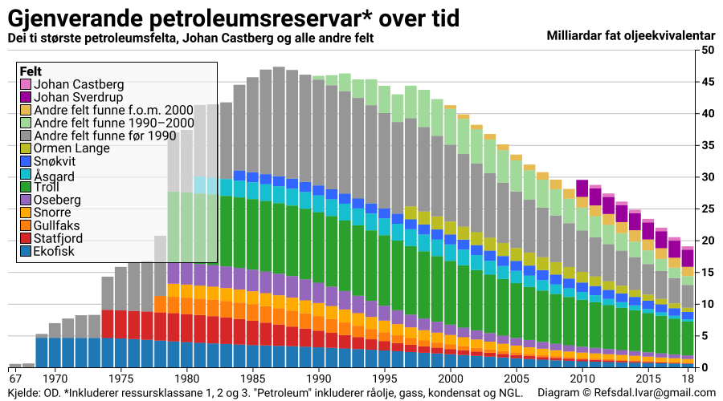

# Flytrafikk

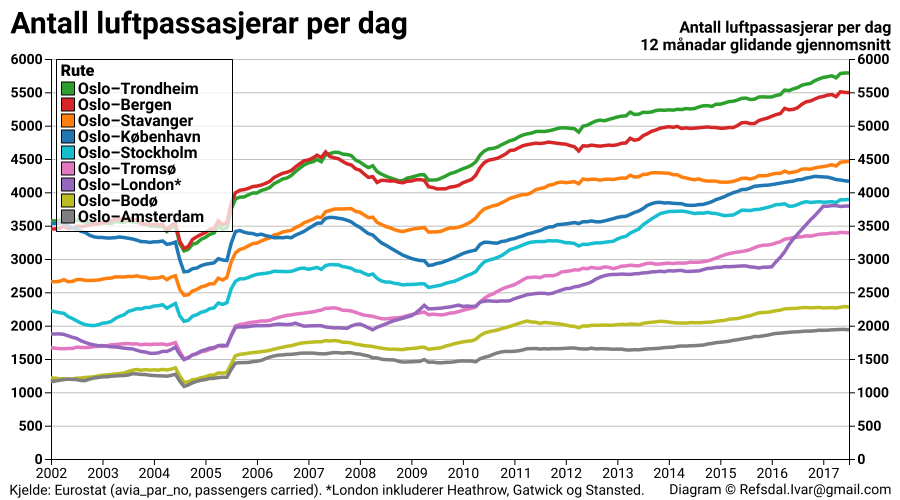

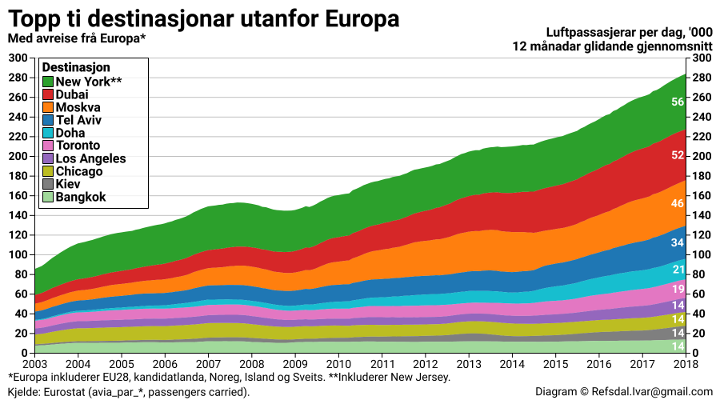

# Køyretøy

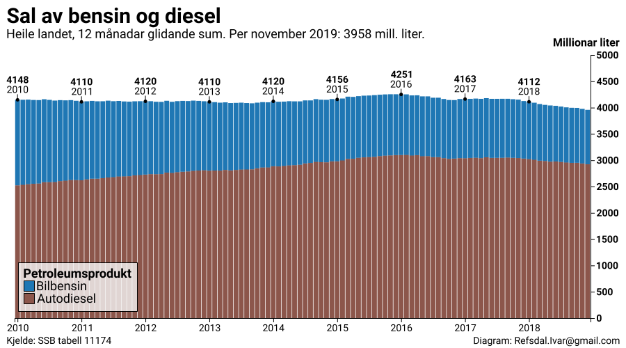

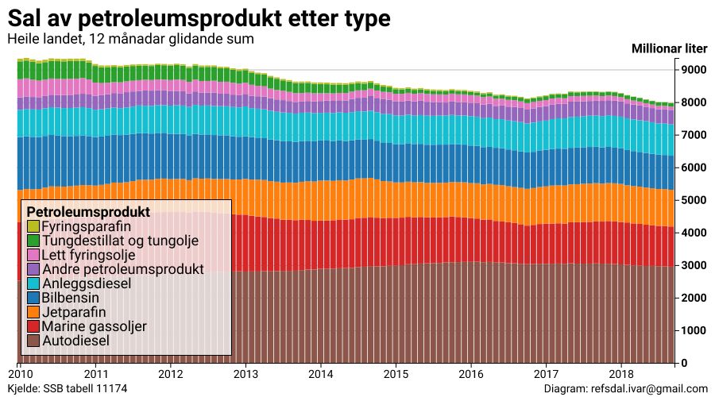

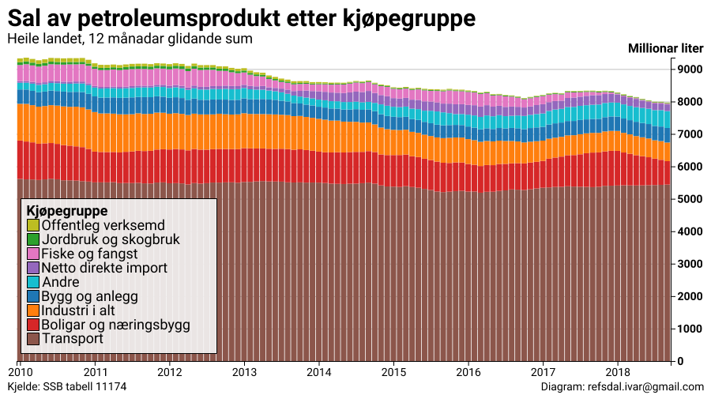

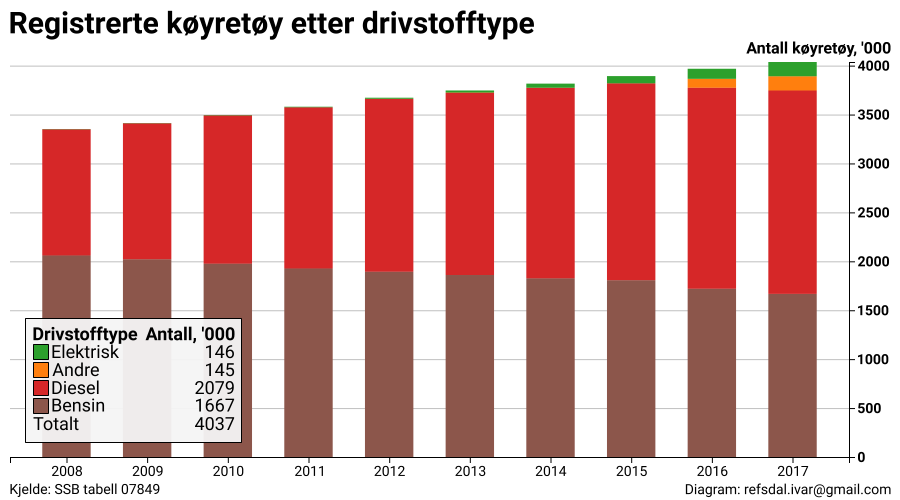

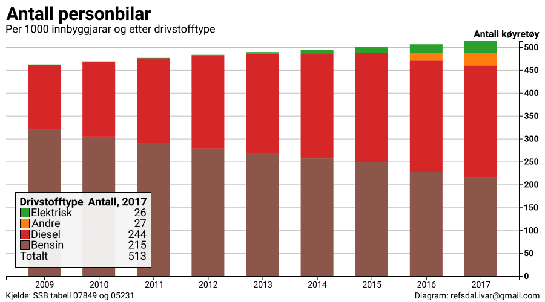

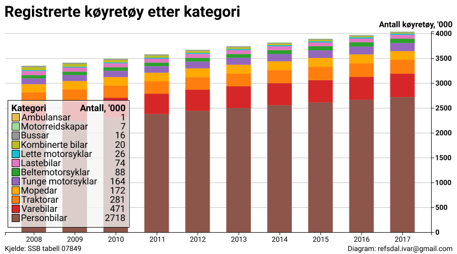

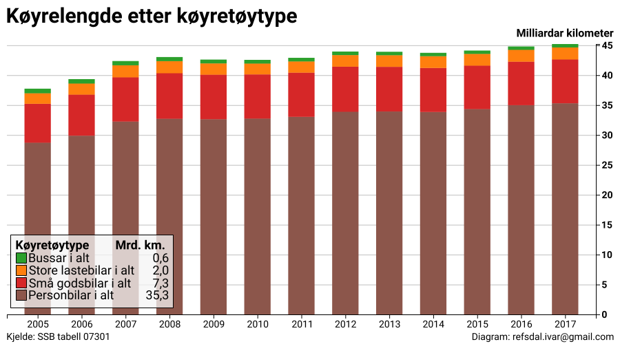

## License

Copyright © 2017 Ivar Refsdal

Distributed under the Eclipse Public License either version 1.0 or (at
your option) any later version.
